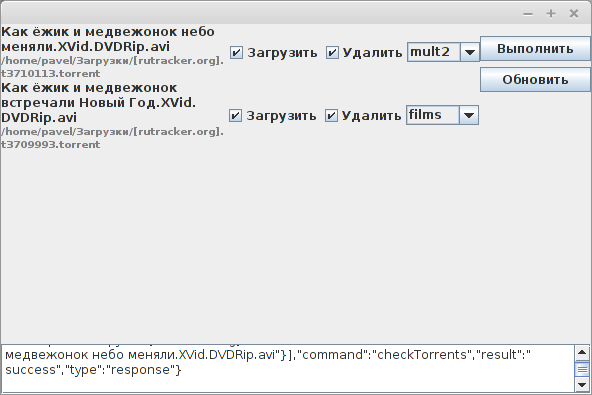

# Torrents loader
Загрузчик торрент файлов из ПК в удаленный Transmission клиент.
В моём случае качалка была в роутере, и качала файлы независимо от ПК.
Программа разрабатывалась для Linux.

Проект выложен в целях ознакомления, в качестве примера Perl кода автора.
Программа исполняла чисто практические задачи, никаких особых архитектур - сборка "на коленке" в течении короткого времени.

# Технологии
- Perl (AnyEvent) - бэкенд на процессах и демонах, язык для быстрого написания чего либо системного.
- Java (Swing) - desktop GUI для взаимодействия с пользователем. Адекватного GUI под Perl в тот момент не нашел.

Процессы между собой и с GUI общаются по пайпам. Благо Java адекватно работает с stdin/stdout.

# Процессы
- у пользователя запущен демон (у меня висел в автозагрузке системы)
- пользователь ищет и скачивает torrent файл из интернета
- демон следит (Linux::Inotify2), и видит новый torrent файл в папке закачек системы, и открывает GUI
- пользователь выполняет действия с файлом
- если выбрано закачать - демон закачивает файл через Transmission RPC (нужен адрес, логин и пароль). Можно и удалить файл.

# По коду
- Main.pm - основной код
- runner.pl - запуск демона
- RequestHandler.pm - работает с Transmission

